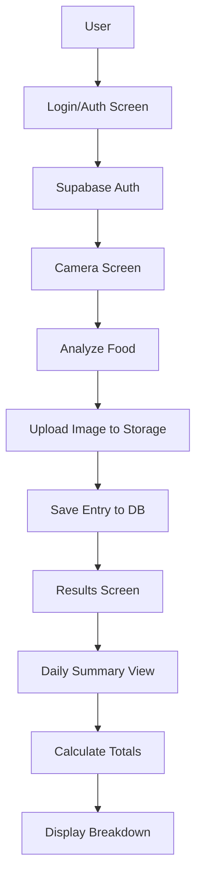

# Supabase Backend Integration Plan

## Overview

Add Supabase backend with user authentication, food entry storage, image uploads to Supabase Storage, and daily nutritional summary calculations.

## Architecture



## Database Schema

### 1. Supabase Setup - Step-by-Step Guide

#### Step 1: Create Supabase Account and Project

1. Go to [https://supabase.com](https://supabase.com)
2. Click "Start your project" or "Sign up"
3. Sign up with GitHub, Google, or email
4. Once logged in, click "New Project"
5. Fill in project details:

   - **Name**: `afird-food-tracker` (or your preferred name)
   - **Database Password**: Create a strong password (save it securely - you'll need it)
   - **Region**: Choose closest to you
   - **Pricing Plan**: Free tier is fine for development

6. Click "Create new project"
7. Wait 2-3 minutes for project to be set up

#### Step 2: Get Your API Keys

1. In your Supabase project dashboard, click on the "Settings" icon (gear icon) in the left sidebar
2. Click "API" in the settings menu
3. You'll see:

   - **Project URL**: Copy this (e.g., `https://xxxxx.supabase.co`)
   - **anon public key**: Copy this (starts with `eyJ...`)
   - **service_role key**: Copy this (starts with `eyJ...`) - **Keep this secret!**

4. Save these in a safe place - you'll add them to `.env.local`

#### Step 3: Set Up Authentication

1. In the left sidebar, click "Authentication"
2. Click "Providers" 
3. Make sure "Email" is enabled (it should be by default)
4. Under "Email Auth", ensure:

   - "Enable email confirmations" - You can disable this for development
   - "Secure email change" - Leave enabled

5. Click "Save"

#### Step 4: Create the Database Table

1. In the left sidebar, click "SQL Editor"
2. Click "New query"
3. Copy and paste this SQL:
```sql
-- Create food_entries table
CREATE TABLE food_entries (
  id UUID PRIMARY KEY DEFAULT uuid_generate_v4(),
  user_id UUID REFERENCES auth.users(id) ON DELETE CASCADE,
  image_url TEXT NOT NULL,
  image_storage_path TEXT NOT NULL,
  meal_type TEXT CHECK (meal_type IN ('breakfast', 'lunch', 'dinner', 'snack')),
  date_time TIMESTAMP WITH TIME ZONE NOT NULL DEFAULT NOW(),
  nutritional_data JSONB NOT NULL,
  created_at TIMESTAMP WITH TIME ZONE DEFAULT NOW(),
  updated_at TIMESTAMP WITH TIME ZONE DEFAULT NOW()
);

-- Create index for faster queries (this is sufficient for all queries)
CREATE INDEX idx_food_entries_user_date ON food_entries(user_id, date_time DESC);
```

4. Click "Run" (or press Cmd/Ctrl + Enter)
5. You should see "Success. No rows returned"

#### Step 5: Set Up Row Level Security (RLS)

1. Still in SQL Editor, create a new query
2. Copy and paste this SQL:
```sql
-- Enable Row Level Security
ALTER TABLE food_entries ENABLE ROW LEVEL SECURITY;

-- Policy: Users can only view their own entries
CREATE POLICY "Users can view own entries" ON food_entries
  FOR SELECT USING (auth.uid() = user_id);

-- Policy: Users can insert their own entries
CREATE POLICY "Users can insert own entries" ON food_entries
  FOR INSERT WITH CHECK (auth.uid() = user_id);

-- Policy: Users can update their own entries
CREATE POLICY "Users can update own entries" ON food_entries
  FOR UPDATE USING (auth.uid() = user_id);

-- Policy: Users can delete their own entries
CREATE POLICY "Users can delete own entries" ON food_entries
  FOR DELETE USING (auth.uid() = user_id);
```

3. Click "Run"
4. You should see "Success. No rows returned"

#### Step 6: Create Storage Bucket

1. In the left sidebar, click "Storage"
2. Click "New bucket"
3. Fill in:

   - **Name**: `food-images`
   - **Public bucket**: Toggle ON (so images can be accessed via URL)

4. Click "Create bucket"

#### Step 7: Set Up Storage Policies

1. Click on the `food-images` bucket you just created
2. Click the "Policies" tab
3. Click "New Policy"
4. Select "For full customization" (or "Custom policy")
5. Name it: "Users can upload their own images"
6. Policy definition:

   - **Allowed operation**: INSERT
   - **Policy definition**: 
   ```sql
   (bucket_id = 'food-images'::text) AND ((auth.uid())::text = (storage.foldername(name))[1])
   ```

   - This ensures users can only upload to folders named with their user ID

7. Click "Review" then "Save policy"

8. Create another policy for reading:

   - Click "New Policy" again
   - Name: "Anyone can view images"
   - **Allowed operation**: SELECT
   - **Policy definition**:
   ```sql
   bucket_id = 'food-images'::text
   ```

   - Click "Review" then "Save policy"

#### Step 8: Verify Setup

1. Go to "Table Editor" in left sidebar
2. You should see `food_entries` table listed
3. Go to "Storage" - you should see `food-images` bucket
4. Go to "Authentication" - you should see the auth setup

#### Step 9: Add Environment Variables to Your Project

1. In your project root, open `.env.local`
2. Add these lines (replace with your actual values from Step 2):
```
NEXT_PUBLIC_SUPABASE_URL=https://xxxxx.supabase.co
NEXT_PUBLIC_SUPABASE_ANON_KEY=your_anon_key_here
SUPABASE_SERVICE_ROLE_KEY=your_service_role_key_here
```

3. Save the file
4. **Important**: Make sure `.env.local` is in `.gitignore` (it should be)

#### Step 10: Test Your Setup (Optional)

1. In Supabase dashboard, go to "Authentication" > "Users"
2. Click "Add user" > "Create new user"
3. Enter a test email and password
4. This creates a test user you can use later

**Setup Complete!** You're now ready to integrate Supabase into your app.

### 2. Database Tables

#### `food_entries` table

```sql
CREATE TABLE food_entries (
  id UUID PRIMARY KEY DEFAULT uuid_generate_v4(),
  user_id UUID REFERENCES auth.users(id) ON DELETE CASCADE,
  image_url TEXT NOT NULL,
  image_storage_path TEXT NOT NULL,
  meal_type TEXT CHECK (meal_type IN ('breakfast', 'lunch', 'dinner', 'snack')),
  date_time TIMESTAMP WITH TIME ZONE NOT NULL DEFAULT NOW(),
  nutritional_data JSONB NOT NULL,
  created_at TIMESTAMP WITH TIME ZONE DEFAULT NOW(),
  updated_at TIMESTAMP WITH TIME ZONE DEFAULT NOW()
);

-- Create index for faster queries (this is sufficient for all queries)
CREATE INDEX idx_food_entries_user_date ON food_entries(user_id, date_time DESC);
```

#### RLS Policies

```sql
ALTER TABLE food_entries ENABLE ROW LEVEL SECURITY;

-- Users can only see their own entries
CREATE POLICY "Users can view own entries" ON food_entries
  FOR SELECT USING (auth.uid() = user_id);

-- Users can insert their own entries
CREATE POLICY "Users can insert own entries" ON food_entries
  FOR INSERT WITH CHECK (auth.uid() = user_id);

-- Users can update their own entries
CREATE POLICY "Users can update own entries" ON food_entries
  FOR UPDATE USING (auth.uid() = user_id);

-- Users can delete their own entries
CREATE POLICY "Users can delete own entries" ON food_entries
  FOR DELETE USING (auth.uid() = user_id);
```

#### Storage Bucket Policies

- Public read access for images
- Authenticated users can upload to their own folder: `{user_id}/{entry_id}.jpg`

## Implementation Files

### 1. [package.json](package.json)

Add dependencies:

- `@supabase/supabase-js` - Supabase client
- `@supabase/auth-helpers-nextjs` - Next.js auth helpers

### 2. [src/lib/supabase.ts](src/lib/supabase.ts)

- Create Supabase client instance
- Export client for use throughout app
- Handle client/server-side instances

### 3. [src/lib/supabaseClient.ts](src/lib/supabaseClient.ts)

- Browser-side Supabase client
- Session management

### 4. [src/lib/supabaseServer.ts](src/lib/supabaseServer.ts)

- Server-side Supabase client
- For API routes and server components

### 5. [src/services/storageService.ts](src/services/storageService.ts)

- `uploadFoodImage()` - Upload image to Supabase Storage
- `deleteFoodImage()` - Delete image from storage
- Generate unique file paths

### 6. [src/services/foodEntryService.ts](src/services/foodEntryService.ts)

- `saveFoodEntry()` - Save entry to database
- `getFoodEntries()` - Get user's entries with filters
- `getFoodEntryById()` - Get single entry
- `deleteFoodEntry()` - Delete entry and image
- `getDailySummary()` - Calculate daily totals

### 7. [src/utils/nutritionCalculations.ts](src/utils/nutritionCalculations.ts)

- `calculateDailyTotals()` - Sum all nutrients for a day
- `aggregateNutritionData()` - Combine multiple entries
- Helper functions for date filtering

### 8. [src/app/api/auth/route.ts](src/app/api/auth/route.ts)

- Login endpoint
- Signup endpoint
- Logout endpoint
- Session management

### 9. [src/app/api/food-entries/route.ts](src/app/api/food-entries/route.ts)

- POST: Create new food entry
- GET: Retrieve entries (with date filtering)
- DELETE: Delete entry

### 10. [src/app/api/daily-summary/route.ts](src/app/api/daily-summary/route.ts)

- GET: Calculate and return daily summary for a specific date
- Query parameters: `date` (YYYY-MM-DD format)

### 11. [src/app/api/user/export-data/route.ts](src/app/api/user/export-data/route.ts)

- GET: Export current user's food entries as JSON or CSV
- Query parameters: `format` (json or csv, default: json)
- Returns all user's entries with full nutritional data
- Includes download headers for file download

### 12. [src/app/api/admin/statistics/route.ts](src/app/api/admin/statistics/route.ts)

- GET: Aggregated statistics across all users (admin only)
- Protected by admin API key or role check
- Returns:
  - Total entries count
  - Unique users count
  - Average calories per entry
  - Most common meal types
  - Daily/weekly/monthly trends
  - Top food items
- All data anonymized (no user IDs or personal info)

### 13. [src/app/login/page.tsx](src/app/login/page.tsx)

- Login form component
- Sign up form (toggle)
- Email/password authentication
- Redirect to home after login

### 12. [src/components/AuthGuard.tsx](src/components/AuthGuard.tsx)

- Protect routes requiring authentication
- Redirect to login if not authenticated
- Show loading state during auth check

### 15. [src/screens/ResultsScreen.tsx](src/screens/ResultsScreen.tsx)

- Add "Save Entry" button
- Call API to save entry after analysis
- Show success/error feedback
- Navigate to history or summary after save

### 16. [src/app/history/page.tsx](src/app/history/page.tsx)

- List all user's food entries
- Filter by date range
- Filter by meal type
- Click to view details

### 15. [src/app/summary/page.tsx](src/app/summary/page.tsx)

- Daily summary view
- Date picker to select date
- Display total calories
- Full breakdown:
  - Macronutrients (protein, carbs, fat)
  - Micronutrients (fiber, sugar, sodium)
  - Vitamins (all vitamins with totals)
  - Minerals (all minerals with totals)
- Visual charts/progress bars (optional)
- List of entries for the day

### 18. [src/components/DailySummaryCard.tsx](src/components/DailySummaryCard.tsx)

- Reusable component for displaying summary data
- Sections for macros, micros, vitamins, minerals
- Progress indicators (optional)

### 19. [src/components/FoodEntryList.tsx](src/components/FoodEntryList.tsx)

- Display list of food entries
- Entry cards with image thumbnail
- Date/time, meal type
- Quick nutrition preview
- Delete functionality

### 20. [src/hooks/useAuth.ts](src/hooks/useAuth.ts)

- Custom hook for authentication state
- `useAuth()` - Get current user and session
- `login()`, `signup()`, `logout()` functions

### 19. [src/hooks/useFoodEntries.ts](src/hooks/useFoodEntries.ts)

- Custom hook for food entries
- `useFoodEntries(date?)` - Fetch entries
- `saveEntry()` - Save new entry
- `deleteEntry()` - Delete entry
- Loading and error states

### 22. [src/app/settings/page.tsx](src/app/settings/page.tsx)

- User settings page
- "Download My Data" button
- Triggers data export API
- Downloads JSON or CSV file
- Shows data privacy information

### 23. [src/app/admin/page.tsx](src/app/admin/page.tsx)

- Admin dashboard (protected by admin check)
- Display aggregated statistics
- Charts/visualizations of:
  - Total entries over time
  - User growth
  - Average nutrition metrics
  - Popular meal types
  - Food trends
- Export aggregated data as CSV/JSON
- No personal user information displayed

### 24. [src/components/DataExportButton.tsx](src/components/DataExportButton.tsx)

- Reusable button component for data export
- Handles download trigger
- Shows loading state
- Supports JSON and CSV formats

### 25. [src/app/layout.tsx](src/app/layout.tsx)

- Add authentication provider
- Navigation bar with:
  - User email/name
  - Logout button
  - Links to Home, History, Summary

## Data Flow

### Saving a Food Entry

1. User captures/selects image
2. Image analyzed with Gemini
3. Image uploaded to Supabase Storage (`{user_id}/{entry_id}.jpg`)
4. Entry saved to `food_entries` table with:

   - `image_url` (public URL)
   - `image_storage_path` (storage path)
   - `nutritional_data` (JSONB with all nutrition info)
   - `date_time` (timestamp)
   - `meal_type`

### Daily Summary Calculation

1. Query all entries for user on selected date
2. Extract `nutritional_data` from each entry
3. Aggregate all values:

   - Sum calories, macros, micros
   - Sum all vitamins
   - Sum all minerals

4. Return aggregated totals

## Environment Variables

Add to `.env.local`:

```
NEXT_PUBLIC_SUPABASE_URL=your_supabase_url
NEXT_PUBLIC_SUPABASE_ANON_KEY=your_supabase_anon_key
SUPABASE_SERVICE_ROLE_KEY=your_service_role_key (server-side only)
ADMIN_API_KEY=your_secret_admin_key (optional, for admin endpoints)
```

## Security Considerations

1. **RLS Policies**: All database queries filtered by user_id
2. **Storage Policies**: Users can only upload to their own folder
3. **API Routes**: Verify authentication on all endpoints
4. **Client-side**: Never expose service role key

## UI/UX Enhancements

1. **Loading States**: Show spinners during save/load operations
2. **Error Handling**: User-friendly error messages
3. **Success Feedback**: Toast notifications for saved entries
4. **Empty States**: Friendly messages when no entries exist
5. **Date Navigation**: Easy date picker for summaries

## Data Export & Statistics Features

### User Data Export

- Users can download their own data via Settings page
- Exports as JSON (structured) or CSV (spreadsheet-friendly)
- Includes all entries with full nutritional data
- Includes image URLs
- GDPR compliant - users own their data

### Admin Statistics

- Aggregated statistics across all users
- Anonymized data (no user IDs or personal info)
- Metrics include:
  - Total entries, unique users
  - Average calories, macros, micros
  - Meal type distribution
  - Daily/weekly/monthly trends
  - Popular food items
- Export aggregated data for analysis
- Protected by admin API key

### Example Statistics Queries

```sql
-- Daily aggregated stats (anonymized)
SELECT 
  DATE(date_time) as date,
  COUNT(*) as total_entries,
  COUNT(DISTINCT user_id) as unique_users,
  AVG((nutritional_data->>'calories')::numeric) as avg_calories
FROM food_entries
GROUP BY DATE(date_time)
ORDER BY date DESC;

-- Meal type distribution
SELECT 
  meal_type,
  COUNT(*) as count,
  ROUND(100.0 * COUNT(*) / SUM(COUNT(*)) OVER (), 2) as percentage
FROM food_entries
WHERE meal_type IS NOT NULL
GROUP BY meal_type;

-- Average nutrition per entry
SELECT 
  AVG((nutritional_data->>'calories')::numeric) as avg_calories,
  AVG((nutritional_data->>'protein')::numeric) as avg_protein,
  AVG((nutritional_data->>'carbohydrates')::numeric) as avg_carbs,
  AVG((nutritional_data->>'fat')::numeric) as avg_fat
FROM food_entries;
```

## Testing Considerations

1. Test authentication flow (login, signup, logout)
2. Test image upload and storage
3. Test entry creation and retrieval
4. Test daily summary calculations
5. Test RLS policies (users can't see others' data)
6. Test date filtering and aggregation
7. Test user data export (JSON and CSV formats)
8. Test admin statistics endpoint (with proper authentication)
9. Verify data anonymization in admin stats
10. Test data download functionality